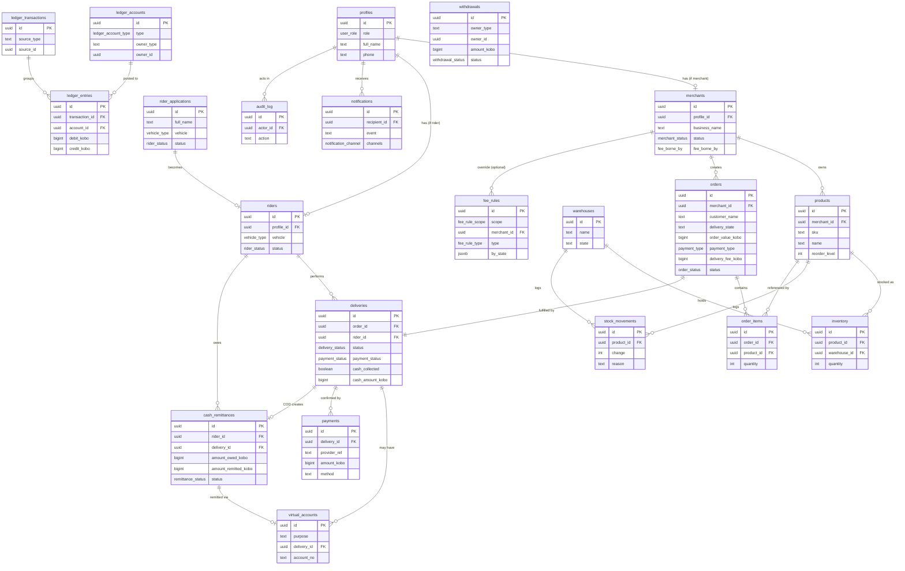

# MELD — Entity-Relationship Diagram

**Version:** 1.0
**Companion to:** `07_DATABASE_SCHEMA.sql`

Rendered with Mermaid. Paste into any Mermaid viewer (or GitHub) to see the diagram.
Money fields are BIGINT kobo; PKs are UUID.

## Reading the money path

1. `orders` → one `deliveries` row (v1: one delivery per order).
2. Delivery payment resolves through `virtual_accounts` (prepaid) or
   `cash_remittances` (COD) → confirmed in `payments`.
3. Every money event posts a `ledger_transactions` with balanced `ledger_entries`
   against `ledger_accounts`.
4. Balances (merchant payable, rider wallet, MELD revenue, cash in transit, partner
   float) are **derived** from `ledger_entries` via the `ledger_balances` view — never
   stored as mutable columns.
5. `withdrawals` move money out (merchant settlement / rider payout) via the partner,
   posting the matching ledger entries.
