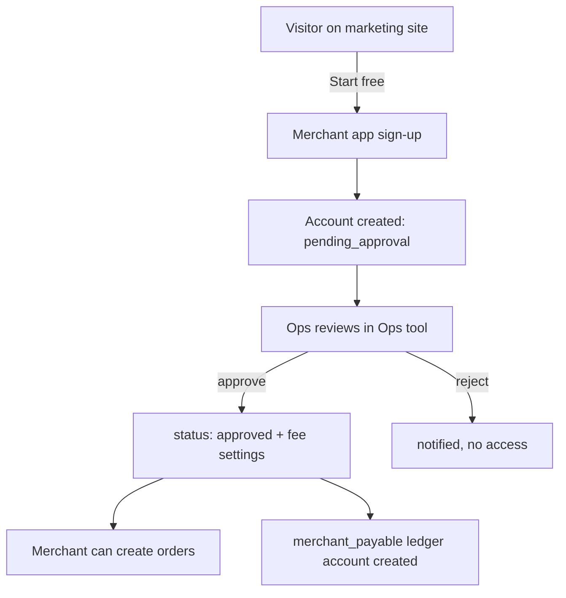
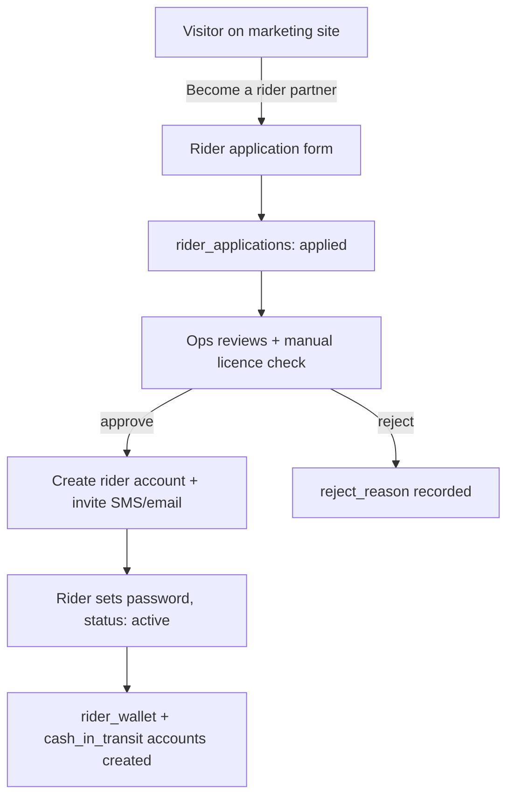
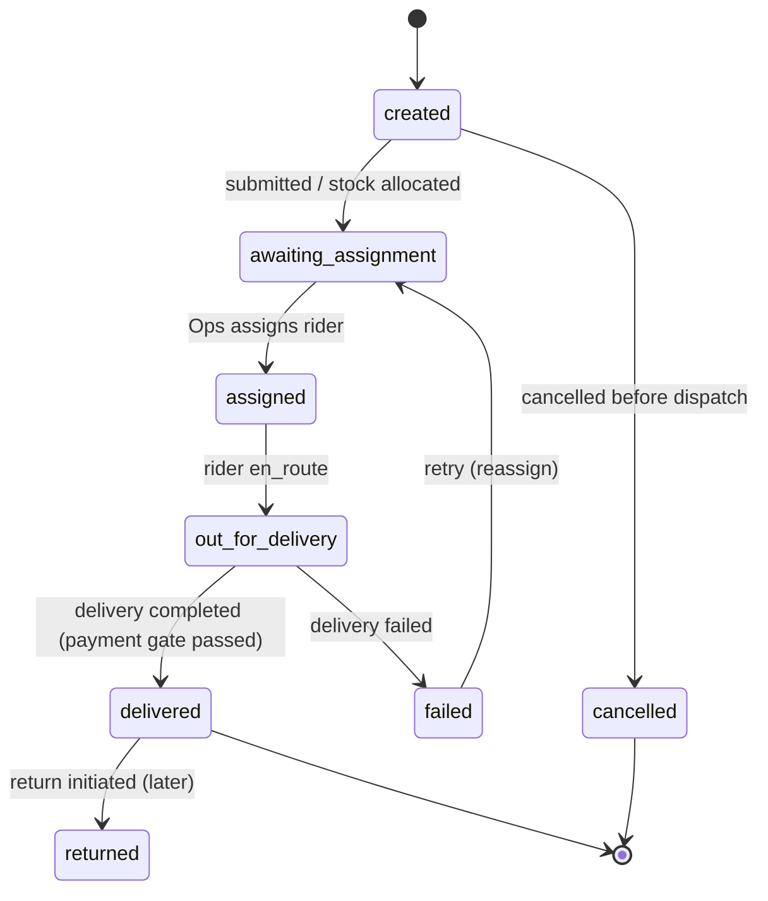
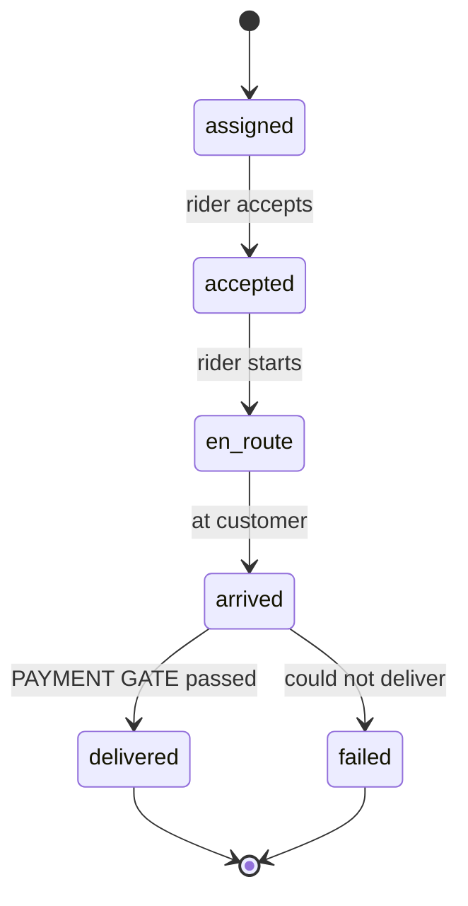
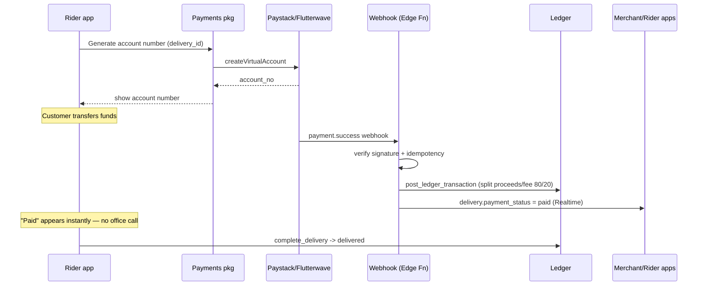
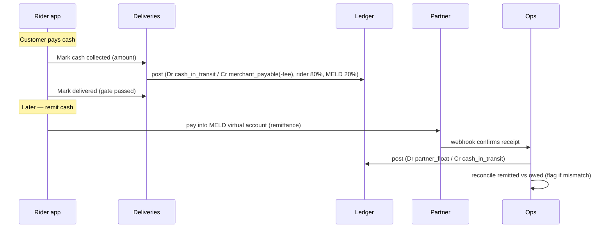
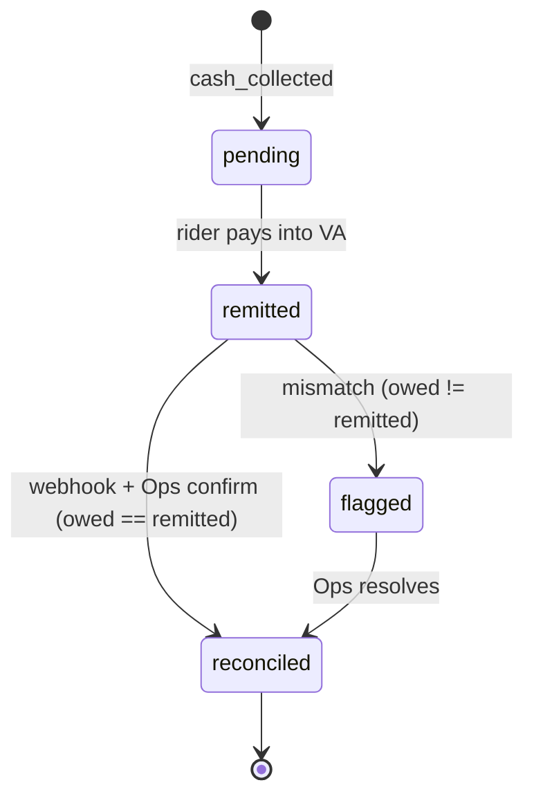
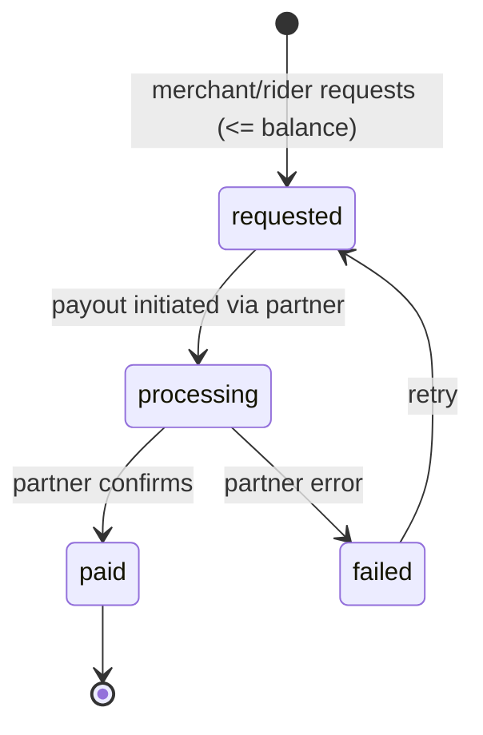
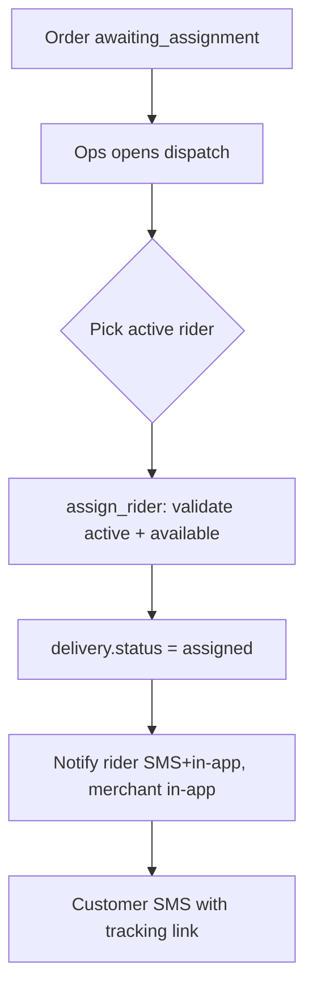
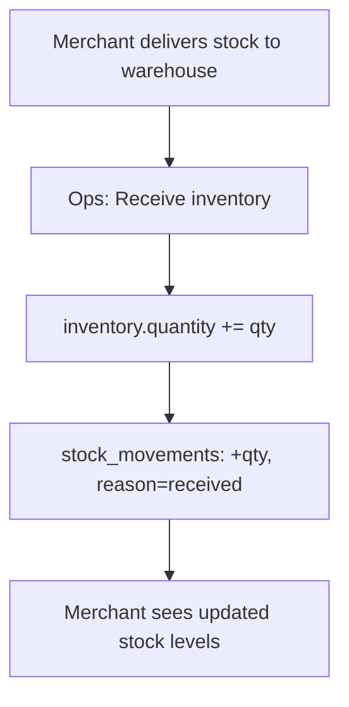

# MELD — Application Flows & State Machines

**Version:** 1.0
**Depends on:** all PRDs, `07_DATABASE_SCHEMA.sql`

Diagrams are Mermaid. These are the canonical flows and allowed state transitions.
Backend must enforce transitions; UIs must not offer disallowed actions.

---

## 1. Merchant onboarding

## 2. Rider onboarding

---

## 3. Order lifecycle (status enum: order_status)

Notes:
- On `created → awaiting_assignment`, inventory is allocated (a negative
  `stock_movements` row + `inventory.quantity` decrement).
- Delivery fee is resolved at `created` via `packages/fees`.

---

## 4. Delivery lifecycle (status enum: delivery_status)

### The payment gate (hard rule)
`arrived → delivered` is allowed **only if**:
- `payment_status = 'paid'` (prepaid via virtual account), **or**
- `cash_collected = true` (COD)

Enforced in `complete_delivery()` server-side, not just UI.

---

## 5. Prepaid payment flow

## 6. COD flow (cash)

Merchant is settled proceeds **minus** delivery fee. Rider earns 80% of fee; MELD 20%.

---

## 7. Rider cash remittance (status enum: remittance_status)

---

## 8. Withdrawal / settlement (status enum: withdrawal_status)

Ledger: on `paid`, post `Dr {merchant_payable|rider_wallet} / Cr partner_float`.
Balance check happens before `requested` is accepted — never allow negative.

---

## 9. Dispatch (manual, v1)

---

## 10. Inventory receiving (Ops)

